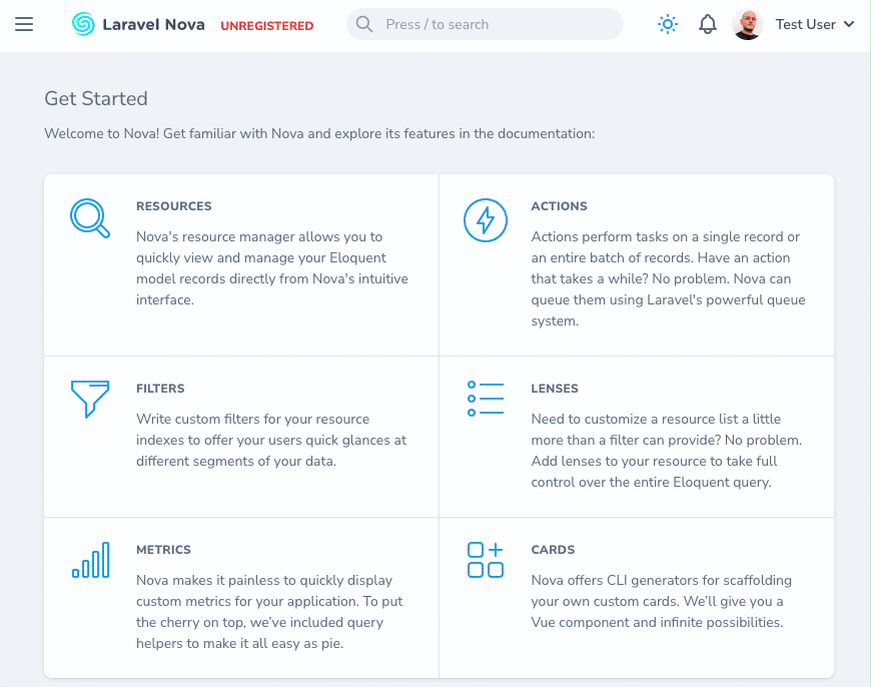

# Redirector SEO for Laravel Nova

[](https://packagist.org/packages/the-3labs-team/nova-redirector-seo)
[](https://github.com/the-3labs-team/nova-redirector-seo/actions?query=workflow%3Arun-tests+branch%3Amain)
[](https://github.com/the-3labs-team/nova-redirector-seo/actions?query=workflow%3A"Fix+PHP+code+style+issues"+branch%3Amain)
[](https://packagist.org/packages/the-3labs-team/nova-redirector-seo)

NovaRedirectorSEO is a all-in-one SEO package for Laravel Nova. It provides a simple way to manage your SEO redirects.



Why choose NovaRedirectorSEO?
* **Pre-configured Laravel Nova resource**, you need only to install, register and configure the package.
* **Middleware** to handle redirects, you can use it in your routes or in your controllers.
* **Cache support**, based on your configuration, the package will cache the redirects. Also, it flush caches when you create, update or delete a redirect.
* **Regex support**, you can use regex in your redirects.

## Installation

You can install the package via composer:

```bash
composer require the-3labs-team/nova-redirector-seo
```

You can publish and run the migrations with:

```bash
php artisan vendor:publish --tag="nova-redirector-seo-migrations"
php artisan migrate
```

You can publish the config file with:

```bash
php artisan vendor:publish --tag="nova-redirector-seo-config"
```

This is the contents of the published config file:

```php
return [
    'cache' => [
        'ttl' => 60 * 60 * 24 * 7, // 7 days
    ],
];
```

It will use the default cache driver configured in your `config/cache.php` file.

If you want to disable the cache, you can set the `ttl` to `null`.

## Usage

Now it's time to configure the package.

### Nova resource

First, register the `NovaRedirectorSeo` tool in your `/app/Providers/NovaServiceProvider.php` (you will probably have to add the entire function):

```php
    /**
     * Register the application's Nova resources.
     *
     * @return void
     */
    protected function resources()
    {
        Nova::resourcesIn(app_path('Nova'));

        Nova::resources([
            \The3LabsTeam\NovaRedirectorSeo\App\Nova\NovaRedirectorSeo::class,
        ]);
    }
```

Now you can access the tool in your Nova panel, under the "SEO" menu.

### Middleware

NovaRedirectorSeo is provided with a middleware that will redirect the user to the correct URL, if the current URL is not the correct one.

You can add this middleware to your `app/Http/Kernel.php` file:

```php
    protected $middleware = [
        \The3LabsTeam\NovaRedirectorSeo\App\Http\Middleware\NovaRedirectorSeoMiddleware::class,
        //...
```

### Policies

You can add a policy to the NovaRedirectorSeo resource, to restrict the access to the resource.

First, you need to create a policy for the NovaRedirectorSeo resource:

```bash
php artisan make:policy NovaRedirectorSeoPolicy
```

Then, register the policy in your `app/Providers/AuthServiceProvider.php` file:

```php
    protected $policies = [
        'The3LabsTeam\NovaRedirectorSeo\App\Models\NovaRedirectorSeo' => 'App\Policies\NovaRedirectorSeoPolicy',
    ];
```

If you need, you can use this policy as a template:

```php
<?php

namespace App\Policies;

use App\Models\User;
use The3LabsTeam\NovaRedirectorSeo\App\Models\NovaRedirectorSeo;
use Illuminate\Auth\Access\HandlesAuthorization;

class NovaRedirectorSeoPolicy
{
    use HandlesAuthorization;

    /**
     * Determine whether the user can view any models.
     *
     * @param  \App\Models\User  $user
     * @return \Illuminate\Auth\Access\Response|bool
     */
    public function viewAny(User $user)
    {
        return true;
    }

    /**
     * Determine whether the user can view the model.
     *
     * @param  \App\Models\User  $user
     * @param  The3LabsTeam\NovaRedirectorSeo\App\Models\NovaRedirectorSeo  $novaRedirectorSeo
     * @return \Illuminate\Auth\Access\Response|bool
     */

    public function view(User $user, NovaRedirectorSeo $novaRedirectorSeo)
    {
        return true;
    }

    /**
     * Determine whether the user can create models.
     *
     * @param  \App\Models\User  $user
     * @param The3LabsTeam\NovaRedirectorSeo\App\Models\NovaRedirectorSeo $novaRedirectorSeo
     * @return \Illuminate\Auth\Access\Response|bool
     */
    public function create(User $user)
    {
        return false;
    }

    /**
     * Determine whether the user can update the model.
     *
     * @param  \App\Models\User  $user
     * @param  The3LabsTeam\NovaRedirectorSeo\App\Models\NovaRedirectorSeo  $novaRedirectorSeo
     * @return \Illuminate\Auth\Access\Response|bool
     */
    public function update(User $user, NovaRedirectorSeo $novaRedirectorSeo)
    {
        return false;
    }

    /**
     * Determine whether the user can delete the model.
     *
     * @param  \App\Models\User  $user
     * @param  The3LabsTeam\NovaRedirectorSeo\App\Models\NovaRedirectorSeo  $novaRedirectorSeo
     * @return \Illuminate\Auth\Access\Response|bool
     */
    public function delete(User $user, NovaRedirectorSeo $novaRedirectorSeo)
    {
        return false;
    }

    /**
     * Determine whether the user can restore the model.
     *
     * @param  \App\Models\User  $user
     * @param  The3LabsTeam\NovaRedirectorSeo\App\Models\NovaRedirectorSeo  $novaRedirectorSeo
     * @return \Illuminate\Auth\Access\Response|bool
     */
    public function restore(User $user, NovaRedirectorSeo $novaRedirectorSeo)
    {
        return false;
    }

    /**
     * Determine whether the user can permanently delete the model.
     *
     * @param  \App\Models\User  $user
     * @param  The3LabsTeam\NovaRedirectorSeo\App\Models\NovaRedirectorSeo  $novaRedirectorSeo
     * @return \Illuminate\Auth\Access\Response|bool
     */
    public function forceDelete(User $user, NovaRedirectorSeo $novaRedirectorSeo)
    {
        return false;
    }
}
```


## Testing

```bash
composer test
```

## Changelog

Please see [CHANGELOG](CHANGELOG.md) for more information on what has changed recently.

## Contributing

Please see [CONTRIBUTING](CONTRIBUTING.md) for details.

## Security Vulnerabilities

Please review [our security policy](../../security/policy) on how to report security vulnerabilities.

## Credits

- [Stefano Novelli](https://github.com/The-3Labs-Team)
- [All Contributors](../../contributors)

## License

The MIT License (MIT). Please see [License File](LICENSE.md) for more information.

## Sponsor

<div>  
    <a href="https://www.tomshw.it/" target="_blank" rel="noopener noreferrer">
          
    </a>
    <a href="https://spaziogames.it/" target="_blank" rel="noopener noreferrer" >
        
    </a>
    <br/>
    <a href="https://cpop.it/" target="_blank" rel="noopener noreferrer" >
        
    </a>
    <a href="https://data4biz.com/" target="_blank" rel="noopener noreferrer" >
        
    </a>
    <br/>
    <a href="https://soshomegarden.com/" target="_blank" rel="noopener noreferrer" >
        
    </a>
    <a href="https://global.techradar.com/it-it" target="_blank" rel="noopener noreferrer" >
        
    </a>
    <br/>
    <a href="https://aibay.it/" target="_blank" rel="noopener noreferrer" >
        
    </a>
    <a href="https://coinlabs.it/" target="_blank" rel="noopener noreferrer" >
        
    </a>

</div>

